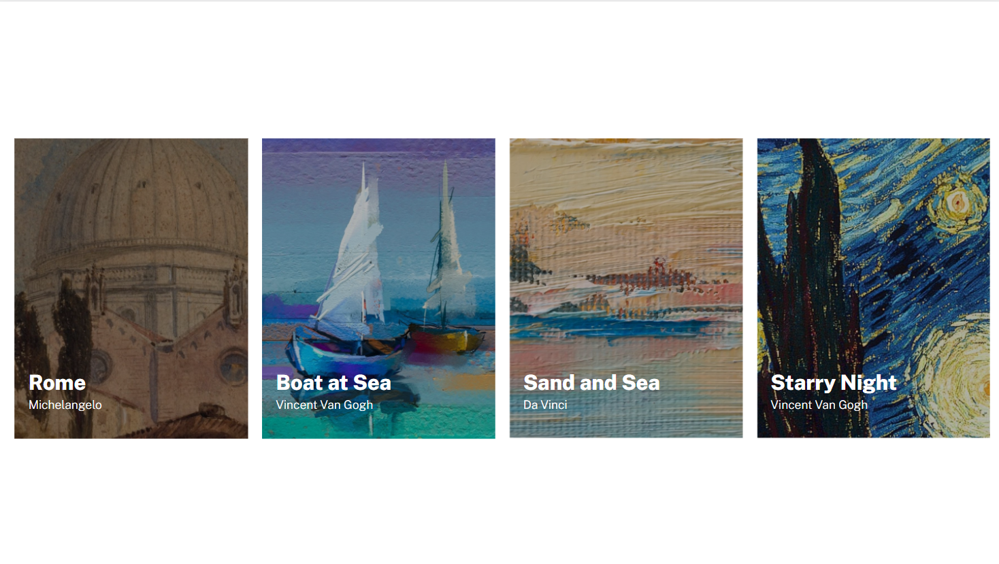
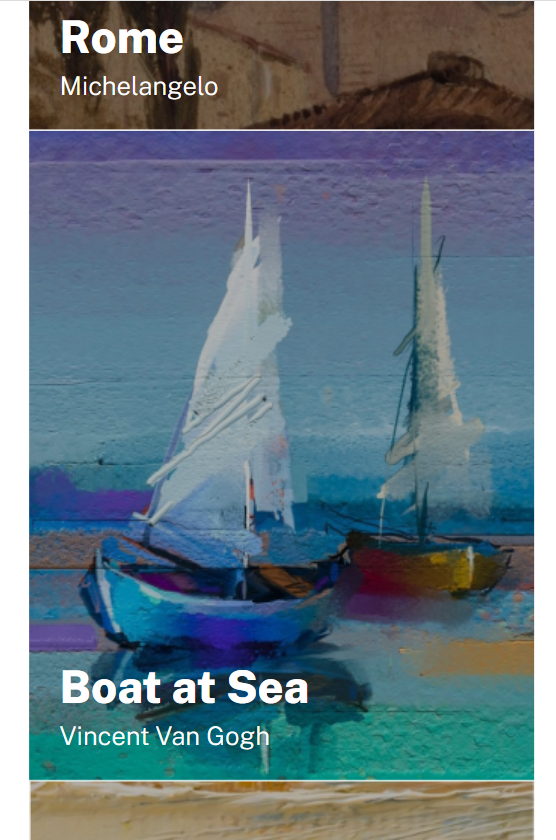

# Lista de imagens

Essa é a solução da realização de um Lista de imagens proposto pelo curso DevQuest.

## Desafio

Criar cards de imagens que sejam responsivas, para ser aprimorado as habilidades de posicionamento de elementos usando flexbox e mediaqueries para a responsividade em mobile.

## Screenshots

Versão para desktop

Versão para mobile

## Tecnologias utilizadas

- HTML
- CSS
- Flexbox

